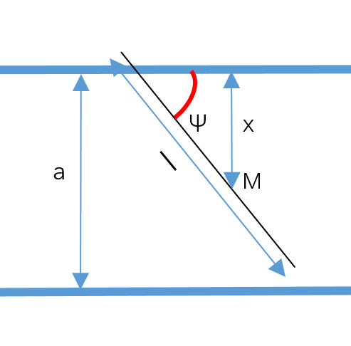
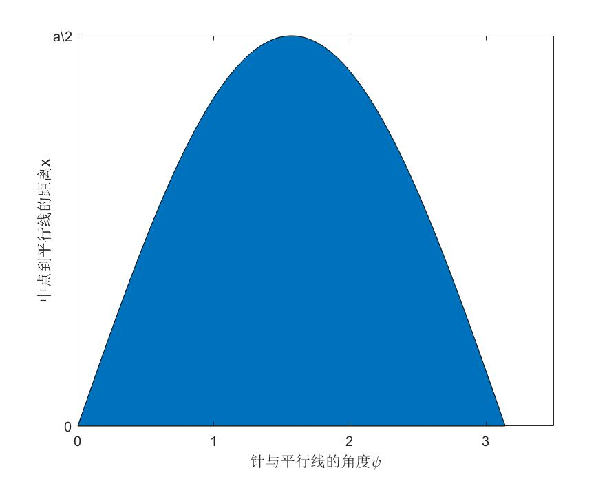

# 蒲丰投针问题研究

> 刘晗桐 171180526

## 理论背景

以$$M$$表示针的中点，x表示M与最近的一条平行线的距离，$$\varphi$$表示投落针与平行线的夹角，以a表示两条平行线的距离，那么显然$$0 <x \le \frac{a}{2}  $$，为了使得投针可以与平行线相交，需要满足$$x\le sin\varphi \frac{l}{2}$$，满足这一关系式的区域记为$$D$$，阴影部分标记如下：

根据积分的几何意义，可以计算得出投针落在矩形区域的概率$$p$$：
$$
p = \frac{D的面积}{Omega的面积} = \frac{\int_ 0 ^\pi \frac{l}{2}sin\varphi dx}{\frac{1}{2}a\pi} = \frac{2l}{a\pi}
$$

## 编程测试

根据上述原理，使用`Unity`物理引擎在`Android`上搭建模拟投针平台，限定针的长度为$$l = 2500$$，平行线间距为$$a = 3000$$，满足$$l < a$$，限于`Unity`游戏引擎屏幕刷新率的限制，取投针次数从`10~1000000`，验证此方案的可行性，得到测试结果表格和图表见下：

| 投针次数 | 碰撞次数 | 估计的$$\pi$$值 |
| -------- | -------- | --------------- |
| 10       | 6        | 2.7778          |
| 100      | 64       | 2.6042          |
| 1000     | 538      | 3.0979          |
|          | 2678     | 3.1118          |
| 10000    | 10000    | 3.1264          |
| 30000    | 16033    | 3.1186          |
| 50000    | 26724    | 3.1183          |
|          | 61529    | 3.1422          |

## 结果分析

